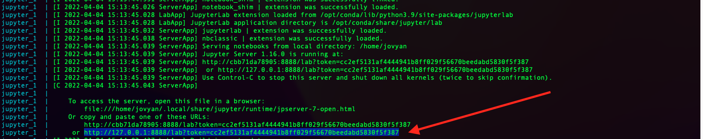
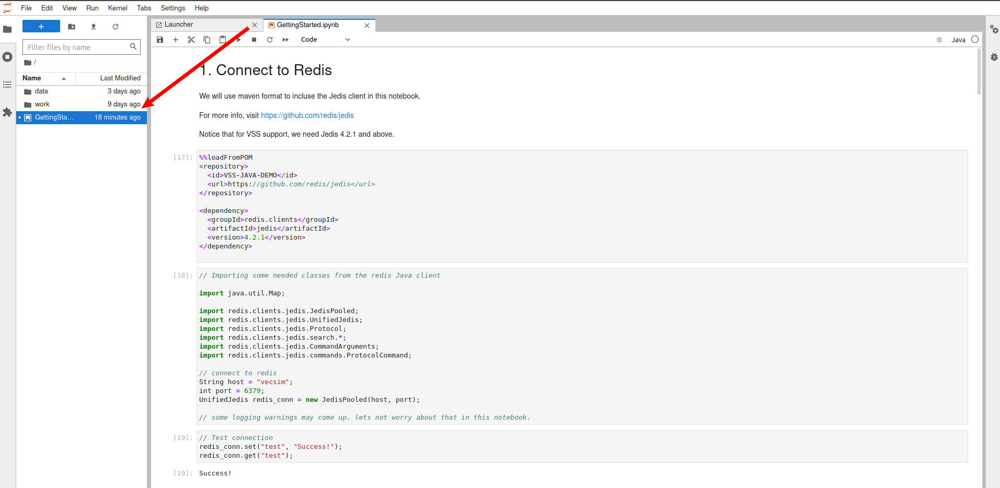

# Java-VSS-demo
A short and simple demo for redis java client with vector similarity search

 This demo make use of Jupyter notebook with Java kernel.

## Clone the Repo 
```
git clone https://github.com/RedisAI/Java-VSS-demo.git
```
## Fire Up the Docker containers
Use docker-compose to start up 2 containers:
* vesim: A redis container with Vector Similarity Search (VSS Private Preview) on port 6379
* jupyter: A Java notebook server on port 8888. This demo make use of Jupyter notebook with Java kernel.
    
```
cd Java-VSS-demo
docker-compose up
```

## Launch the Jupyter Notebook
Monitor the logs 

Look out for the link to launch jupyter on your local machine
Open a browser to this link



Then open the "GettingStarted" notebook




Run All Cells and check the outputs
